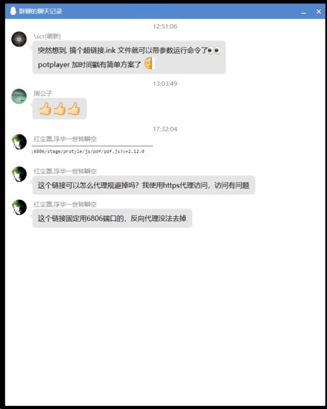

# zhenxun-bot-plugin-siyuan

<center>


</center>

可爱的 QQ 机器人 [绪山真寻 Bot](https://hibikier.github.io/zhenxun_bot/) 的 [思源笔记](https://github.com/siyuan-note/siyuan) 插件, 可以将 QQ 群转化为思源笔记的收集箱

如果需要订阅思源笔记的增值服务，欢迎使用我的推荐码: **`h0sc9rc`** (\*^▽^\*)

## 预览 | PREVIEW

### 普通消息 & 文件 | NORMAL MESSAGE & FILE


### 合并转发消息 | MERGE FORWARD MESSAGE




## 功能 | FUNCTION

1. 将一个群设置为收集箱时, 在绑定的文档下级会新建一个子文档作为今日的收集箱
   - 文档标题为当前日期
2. 每日 00:00:01 时, 在每个绑定的文档下级都会新建一个子文档作为当日的收集箱
   - 文档标题为当日日期
3. 上传群资源文件并插入到文档中
   - 块属性
     - `custom-post-type="notice"` 消息类型: 群通知
     - `custom-sender-id="0123456789"` 文件上传者ID: QQ号
     - `custom-time="1643450342"` 通知发送时间: 文件上传时间
   - 回复内容: 
     - `一个文件名`: 刚刚上传文件的文件名
       - `新文档.docx`
       - `<文件名(不带ID).<文件扩展名>>`
     - `一个超链接`: 可以跳转到刚刚插入的块的超链接(需要配合 `theme.js` 使用, 详情见安装教程第 6 步)
       - `https://your.domain.name:6806/stage/build/desktop/?id=20220129235304-436oqnz`
       - `http(s)://<主机名>:<端口号>/stage/build/desktop/?id=<刚刚插入块的ID>`
     - `一个 URL`, 可以引用刚刚插入资源的 URL(若设置了访问授权码, 则登录后获得 `cookie` 才能正确请求资源)
       - `https://your.domain.name:6806/assets/Security_SSL_96px-20220129004744-se0iim1.png)`
       - `http(s)://<主机名>:<端口号>/assets/<文件名>-<文件ID>.<扩展名>)`
     - `一个 URL`: 可以从 QQ 的文件服务器中下载文件的直链 URL, 没有鉴权
       - `http://109.244.227.121/ftn_handler/0123456789abcdef0123456789abcdef0123456789abcdef0123456789abcdef0123456789abcdef0123456789abcdef0123456789abcdef0123456789abcdef/?fname=0123456789abcdef0123456789abcdef0123456789abcdef0123456789abcdef0123456789`
       - `http://<文件服务器的IP>/ftn_handler/<128个16进制字符(512位)的文件哈希值>/?fname=<74个16进制字符(296位)的文件名编码>`
   - 资源文件类型
     - 消息中的图片 -> 上传图片并嵌入图片链接
       - ``
       - `)`
     - 上传的群文件 -> 上传文件并嵌入文件链接
       - `[新文档.docx](assets/新文档-20220129171811-hsqksm3.docx)`
       - `[文件名](assets/文件名-<文件ID>.<扩展名>)`
     - 语音消息 -> 上传文件并嵌入音频块
       - `<audio controls="controls" src="assets/record1623120470117-20220129175651-lgbokxe.wav"></audio>`
       - `<audio controls="controls" src="assets/音频文件名-<文件ID>.<扩展名>))"></audio>`
     - 视频消息 -> 上传文件并嵌入视频块
       - `<video controls="controls" src="assets/2a11ba9ec31df24f9ed7acb79fe30d87-20220129235304-545xewt.video"></video>`
       - `<video controls="controls" src="assets/视频文件名-<文件ID>.<扩展名>))"></video>`
4. 解析群中的所有消息
   - 块属性
     - `custom-post-type="message"` 消息类型: 群消息
     - `custom-message-id="-1689421685"` 群消息ID: 消息ID
     - `custom-message-seq="153"` 群消息序号: 该群第n条消息
     - `custom-sender-id="0123456789"` 消息发送者ID: QQ号
     - `custom-sender-nickname="昵称"` 消息发送者昵称: QQ昵称
     - `custom-sender-card="群名片或群备注"` 消息发送者群备注姓名: 备注姓名
     - `custom-time="1643450342"` 该消息发送时间: 消息发送时间
   - 普通文本消息 -> 移除空行, 构造并插入一个块(可以直接插入 Markdown 语句)
     - 消息中只有一个超链接 -> 渲染为超链接
       - `[https://ld246.com/article/1643468500328](https://ld246.com/article/1643468500328)`
       - `[超链接URL](超链接URL)`
   - QQ 表情 -> 引用思源笔记 `<工作空间>/data/emojis/qq-gif/` 目录下的动态表情图片 (详情见安装教程第 7 步)
     - `:qq-gif/174:`
     - `:qq-gif/<表情ID>:`
   - 图文混排 -> 移除空行, 保持混排样式构造并插入一个块(也可以使用 Markdown 插入网络图片)
   - @群成员 -> <u>@<QQ号></u>
     - `<u>@0123456789</u>`
     - `<u>@<QQ号></u>`
   - 回复消息 ->
     - 若从收集箱中搜索到被回复的消息对应的块, 创建该块的块引用
       - `((20220129171554-j5m8g2p "[CQ:reply,qq=0123456789,id=-67072678]"))`
       - `((<被回复块的块ID> "[CQ:reply,qq=<被回复块的发送者>,id=<被回复块的消息ID>]"))`
     - 若未从收集箱中搜索到被回复的消息对应的块
       - `[CQ:reply,qq=<被回复块的发送者>,id=<被回复块的消息ID>]`
   - 合并转发消息 -> 解析转发的所有消息, 构造并插入一个纵向排列的超级块(不能再次嵌套合并转发消息, 再次嵌套将解析为 XML 消息)
     - 合并转发消息内各节点构造的内容块的块属性
       - `custom-post-type="node"` 消息类型: 合并转发节点
       - `custom-sender-id="0123456789"` 被转发消息的发送者ID: QQ号
       - `custom-sender-nickname="昵称"` 被转发消息的发送者昵称: QQ昵称
       - `custom-time="1643450342"` 被转发消息实际发送时间: 消息发送时间
     - ```markdown
       {{{row
       <!-- 每一条消息构成超级块内的一个子块 -->
       }}}
       ```
   - 分享链接 -> 带锚文本与标题的超链接(可能带有图片)
   - XML 消息 -> 一种卡片式消息, 构造并插入一个含有格式化后 xml 对象的代码块
     - ```xml
       <?xml version="1.0" ?>
       <msg brief="[聊天记录]" m_fileName="MultiMsg_F896B299-7613-4D4B-8E12-ADA0DC9CB92A" action="viewMultiMsg" tSum="2" flag="3" serviceID="35" m_fileSize="100">
            <item layout="1">
                <title color="#000000" size="34">  群聊的聊天记录  </title>
                <title color="#000000" size="26">  A:@B ABCDEF  </title>
                <title color="#000000" size="26">  B:[分享]0123456  </title>
                <hr/>
                <summary color="#808080" size="26"> 查看转发消息  </summary>
            </item>
            <source name="聊天记录"/>
        </msg>
       ```
   - JSON 消息 -> 一种卡片式消息, 构造并插入一个含有格式化后 json 对象的代码块
     - ```json
       {
           "app": "com.tencent.wezone.share",
           "config": {
               "autosize": 0,
               "ctime": 1643446171,
               "token": "ea5a33fe6a74cde7cdfb40a6262dfe18"
           },
           "desc": "",
           "prompt": "\u5206\u4eab\u4e86\u6765\u81ea\u5c0f\u4e16\u754c\u7684\u4f5c\u54c1",
           "ver": "1.0.0.5",
           "view": "shareView"
       }
       ```
   - 其他消息 -> CQ 码, 详情请查看 [CQcode | go-cqhttp 帮助中心](https://docs.go-cqhttp.org/cqcode/)
     - `[CQ:<消息类型>[, <键>=<值>[, ...]]]`
     - `[CQ:redbag,title=<标题>]` 红包消息
     - `[CQ:gift,qq=<目标用户QQ>,id=<礼物ID>]` 礼物消息
     - `[CQ:<消息类型>]` 其他消息
       - `[CQ:rps]` 猜拳魔法表情
       - `[CQ:dice]` 掷骰子魔法表情
       - `[CQ:shake]` 窗口抖动
       - `[CQ:contact]` 推荐好友/群
       - `[CQ:location]` 位置
       - `[CQ:poke]` 戳一戳
       - `[CQ:cardimage]` 图片卡片

## 开始 | START

1. 安装 `go-cqhttp` 
   - 安装教程: [安装go-cqhttp | 绪山真寻Bot](https://hibikier.github.io/zhenxun_bot/docs/installation_doc/install_gocq.html)
   - 项目文档: [go-cqhttp 帮助中心](https://docs.go-cqhttp.org/)
   - 项目仓库: [GitHub - Mrs4s/go-cqhttp: cqhttp的golang实现，轻量、原生跨平台.](https://github.com/Mrs4s/go-cqhttp)
2. 安装 `Postgresql` 数据库
   - 安装教程: [安装Postgresql数据库 | 绪山真寻Bot](https://hibikier.github.io/zhenxun_bot/docs/installation_doc/install_postgresql.html)
   - 项目文档:
     - [PostgreSQL: Documentation](https://www.postgresql.org/docs/)
     - [文档目录/Document Index: 世界上功能最强大的开源数据库...](http://www.postgres.cn/v2/document)
3. 安装 `绪山真寻 Bot`
   - 安装教程: [安装真寻Bot | 绪山真寻Bot](https://hibikier.github.io/zhenxun_bot/docs/installation_doc/install_zhenxun.html)
   - 项目文档: [绪山真寻Bot](https://hibikier.github.io/zhenxun_bot/)
   - 项目仓库: [GitHub - HibiKier/zhenxun_bot: 基于 Nonebot2 和 go-cqhttp 开发，以 postgresql 作为数据库，非常可爱的绪山真寻bot](https://github.com/HibiKier/zhenxun_bot)
4. 额外安装本插件的依赖包并安装本插件
   - 安装依赖包 `httpx`
     - 使用 `pip` 安装
       ```bash
       pip install httpx
       ```
     - 或者, 使用 `conda` 安装
       ```bash
       conda install httpx -c conda-forge
       ```
   - 安装本插件
     - 将本插件项目中的 `/plugins/siyuan` 目录移动到  `<绪山真寻Bot程序根目录>/plugins/siyuan` 目录
5. 安装本插件完成后运行一次 `绪山真寻 Bot`, 会生成插件配置选项, 进行插件配置
   - 打开文件 `data/configs/plugins2config.yaml`
   - 搜索并填写如下 5 个字段的 `value` 与 `default_value` 值
     - `SIYUAN_HOST`: 思源笔记内核所在主机名
       - 类型: 字符串
       - 示例: `'localhost'`
       - 说明: 可以填本机 `localhost`, 其他主机 `IP 地址` 或其他主机 `域名`
       - 备注: 如果思源笔记使用 Nginx 反向代理, 那么填写反向代理指向的主机即可
     - `SIYUAN_PORT`: 思源笔记内核监听端口
       - 类型: 字符串
       - 示例: `'6806'`
       - 说明: 填写思源笔记内核监听的端口
       - 备注: 如果思源笔记使用 Nginx 反向代理, 那么填写反向代理的目标端口即可
     - `SIYUAN_SSL`: 思源笔记是否启用 SSL
       - 类型: 布尔值
       - 示例: `false`
       - 说明: 是否启用 SSL 安全协议
       - 备注: 该选项取决于 `真寻 bot` 访问目标主机是否需要使用 `HTTPS` 协议
     - `SIYUAN_TOKEN`: 思源笔记 API Token
       - 类型: 字符串(16字符)
       - 示例: `'0123456789ABCDEF'`
       - 说明: 若思源笔记启用 `访问授权码 (设置>关于>访问授权码)`, 则需要配置有效的 `API token (设置>关于>API token)`
       - 备注: 若未启用 `访问授权码`, 该字段可以填充任意字符串
     - `SIYUAN_URL`: 思源笔记 URL
       - 类型: 字符串
       - 示例: `'https://your.domain.name:6806'`
       - 说明: 使用 `http` 协议与 `80` 端口或使用 `https` 协议与 `443` 端口可以省略端口号, 请确保 `<该字段值>/stage/build/desktop/` 可以进入思源笔记主界面, 
       - 备注: 该字段用于生成一个指向刚刚插入块的 URL
   - 配置完成后需要重新启动 `绪山真寻 Bot`
6. 使用 `theme.js` 为思源笔记添加使用 URL 参数跳转指定块的功能
   - 带参 URL 示例: `https://your.domain.name:6806/stage/build/desktop/?id=20220128232710-huurm0y`
     - 该参数可以在从当前聚焦的页签中切换到 id 为 `20220128232710-huurm0y` 的块
   - 主题 `Dark+` 的 `v0.2.0+` 版本已内置了该功能, 若使用该主题 `v0.2.0+` 版本可跳过该步骤, 详情请参考 [Zuoqiu-Yingyi/siyuan-theme-dark-plus](https://github.com/Zuoqiu-Yingyi/siyuan-theme-dark-plus)
   - 其他主题可以将如下 js 片段放在文件 `<工作空间>/conf/appearance/themes/<主题名>/theme.js` 开头(若没有该文件新建即可)
     ```js
     function loadScript(url) {
        let script = document.createElement('script');
        script.setAttribute('type', 'module');
        script.setAttribute('src', url);
        document.getElementsByTagName('head')[0].appendChild(script);
     }

     (function () {
         loadScript("/appearance/themes/goto.js");
     })()
     ```
     并新建文件 `<工作空间>/conf/appearance/themes/goto.js`, 在该文件中写入如下内容
     ```js
     /** 使用形如 id=<块 ID> 的 URL 参数跳转到指定的块
     *  REF [leolee9086](https://github.com/leolee9086)
     */
     function urlParser(url) {
         url = url || '';
         const queryObj = {};
         const reg = /[?&]([^=&#]+)=([^&#]*)/g;
         const queryArr = url.match(reg) || [];
         // console.log(queryArr)
         for (const i in queryArr) {
             if (Object.hasOwnProperty.call(queryArr, i)) {
                 const query = queryArr[i].split('=');
                 const key = query[0].substr(1);
                 const value = decodeURIComponent(query[1]);
                 queryObj[key] ? queryObj[key] = [].concat(queryObj[key], value) : queryObj[key] = value;
             }
         }
         console.log(queryObj)
         return queryObj;
 
     }
     function goto(id) {
         let doc = window.document
         // console.log(doc)
         let link = doc.createElement("span")
         link.setAttribute("data-type", "block-ref")
         link.setAttribute("data-id", id)
         let target = doc.querySelector(".protyle-wysiwyg div[data-node-id] div[contenteditable]")
         if (target) {
             target.appendChild(link)
             link.click()
             link.remove()
         }
         else {
             setTimeout(async () => goto(id), 1000)
         }
     }
     async function jumpToID() {
         let params = urlParser(window.location.href)
         if (params) {
             let id = params.id
             if (id) {
                 goto(id)
             }
         }
     }
     window.onload = setTimeout(jumpToID(), 0)
     ```
7. 上传 QQ 表情图片到思源笔记的 `<工作空间>/data/emojis/` 目录
   - 表情图片从 [coolq-http-api/docs/qq-face](https://github.com/kyubotics/coolq-http-api/tree/master/docs/qq-face) 目录打包下载, 可以使用项目 [DownGit](https://minhaskamal.github.io/DownGit/#/home) 打包该目录
   - 表情 ID 与表情图片的映射关系可以从 [表情 CQ 码 ID 表](https://github.com/kyubotics/coolq-http-api/wiki/%E8%A1%A8%E6%83%85-CQ-%E7%A0%81-ID-%E8%A1%A8) 查看
   - 在思源笔记的工作空间中分别创建 `<工作空间>/data/emojis/qq-gif/` 与 `<工作空间>/data/emojis/qq-png/` 两个目录
   - 将打包下载的表情图片中所有 `*.gif` 动态表情图片与所有 `*.png` 静态表情图片分别上传到 `qq-gif` 与 `qq-png` 目录中
8. 在 bot 访问的思源笔记本 Web 端中选择一个文档作为收集箱(选择笔记本内的一个文档而非笔记本), 并记录该文档的绝对路径
   - 假设选择在 `收集箱` 笔记本内的 `Inbox` 文档作为收集箱, 该文档的 ID 为 `20220128203409-j5553g7` (可以从该文档的右键菜单中获取文档的 ID)
   - 从文件系统中搜索 `20220128203409-j5553g7.sy` 文件, 并获得该文件相对于 `<工作空间>/data/` 目录的路径, 例如 `20220128203353-2p55r7q/20220128203409-j5553g7.sy`
     - 其中 `20220128203353-2p55r7q/` 为 `收集箱` 笔记本的目录
     - 其中 `20220128203409-j5553g7.sy` 为 `Inbox` 文档的数据文件
9.  依次启动 `go-cqhttp`, `Postgresql` 与 `绪山真寻 bot`
10.  使用超级用户账户向机器人账户发送如下命令进行收集箱管理
   - `添加到收集箱 [笔记本ID/文档路径] [群号]`
     - 示例: `添加到收集箱 20220128203353-2p55r7q/20220128203409-j5553g7.sy 123456789`
     - `[文档路径完整路径]` 需要填写第 8 步获得的文档完整路径, 这里是 `20220128203353-2p55r7q/20220128203409-j5553g7.sy`
     - `[群号]` 需要填写作为收集箱的群号(机器人必须已经加入该群), 这里是 `123456789`, 该群与 ID 为 `20220128203409-j5553g7` 的文档绑定
       - 注意: 一旦完成绑定, 该文档不可移动, 若需要移动则需要移除收集箱后重新添加收集箱
     - 注: 添加到该收集箱的资源文件在这里会放置在 `20220128203353-2p55r7q/20220128203409-j5553g7/assets/` 目录下
   - `从收集箱移除 *[群号]`
     - 示例: `从收集箱移除 123456789 987654321`
     - `*[群号]` 即为想要移除的、作为收集箱的群号列表, 多个群号中间使用空格隔开
     - 注1: 将一个或多个群移除后已经添加到对应收集箱的内容不会随之删除
     - 注2: 移除的群可以再次设置为收集箱
   - `列出收集箱`
     - 示例: `列出收集箱`
     - 该命令会列出所有的作为收集箱的群号

## 自定义配置 | CUSTOM CONFIG

配置文件路径: `<绪山真寻bot根目录>/data/configs/plugins2config.yaml`

### 配置示例 | CONFIG EXAMPLE

```yaml
siyuan:
  SIYUAN_HOST:
    value: localhost
    name: 主机名
    help: 思源笔记内核所在主机名
    default_value: localhost
    level_module:
  SIYUAN_PORT:
    value: '6806'
    name: 端口号
    help: 思源笔记内核监听端口
    default_value: '6806'
    level_module:
  SIYUAN_SSL:
    value: false
    name: 启用 SSL
    help: 思源笔记是否启用 SSL
    default_value: false
    level_module:
  SIYUAN_TOKEN:
    value: 0123456789ABCDEF
    name: Token
    help: 思源笔记 API Token
    default_value: 0123456789ABCDEF
    level_module:
  SIYUAN_URL:
    value: https://your.domain.name
    name: Token
    help: 思源笔记 URL
    default_value: https://your.domain.name
    level_module:
```


## 依赖 & 参考 & 感谢 | DEPENDENCE & REFERENCE & THANKS

| 项目 \| Project                                        | 仓库 \| Repo                                                                                                           | 作者 \| Author                                       | 许可证 \| License                                                                      |
| :----------------------------------------------------- | :--------------------------------------------------------------------------------------------------------------------- | :--------------------------------------------------- | :------------------------------------------------------------------------------------- |
| [绪山真寻Bot](https://hibikier.github.io/zhenxun_bot/) | [GitHub - HibiKier/zhenxun_bot](https://github.com/HibiKier/zhenxun_bot)                                               | **[HibiKier](https://github.com/HibiKier)**          | *[AGPL\-3.0 License](https://github.com/HibiKier/zhenxun_bot/blob/main/LICENSE)*       |
| [NoneBot](https://v2.nonebot.dev/)                     | [GitHub - nonebot/nonebot2](https://github.com/nonebot/nonebot2)                                                       | **[NoneBot](https://github.com/nonebot)**            | *[MIT License](https://github.com/nonebot/nonebot2/blob/master/LICENSE)*               |
| [OneBot](https://onebot.dev/)                          | [GitHub - botuniverse/onebot](https://github.com/botuniverse/onebot)                                                   | **[Bot Universe](https://github.com/botuniverse)**   | *[MIT License](https://github.com/botuniverse/onebot/blob/master/LICENSE)*             |
| [GO-CQHTTP](https://go-cqhttp.org/)                    | [GitHub - Mrs4s/go-cqhttp](https://github.com/Mrs4s/go-cqhttp)                                                         | **[Mrs4s](https://github.com/Mrs4s)**                | *[AGPL\-3.0 License](https://github.com/Mrs4s/go-cqhttp/blob/master/LICENSE)*          |
| 真寻 bot 的插件库                                      | [GitHub - AkashiCoin/nonebot_plugins_zhenxun_bot](https://github.com/AkashiCoin/nonebot_plugins_zhenxun_bot)           | **[AkashiCoin](https://github.com/AkashiCoin)**      | *Unknown*                                                                              |
| Nakuru Project                                         | [GitHub - Lxns-Network/nakuru-project](https://github.com/Lxns-Network/nakuru-project)                                 | **[Lxns\-Network](https://github.com/Lxns-Network)** | *[MIT License](https://github.com/Lxns-Network/nakuru-project/blob/master/LICENSE)*    |
| HimesakaBot                                            | [GitHub - mobyw/nonebot-twitter-guild](https://github.com/mobyw/nonebot-twitter-guild)                                 | **[mobyw](https://github.com/mobyw)**                | *[GPL\-3.0 License](https://github.com/mobyw/nonebot-twitter-guild/blob/main/LICENSE)* |
| NoneBot Plugin APScheduler                             | [GitHub - nonebot/plugin-apscheduler: APScheduler Support for NoneBot2](https://github.com/nonebot/plugin-apscheduler) | **[nonebot](https://github.com/nonebot)**            | *[MIT License](https://github.com/nonebot/plugin-apscheduler/blob/master/LICENSE)*     |

<!-- | | | **** | ** | -->

注: 排名不分先后

## 更改日志 | CHANGE LOGS

[CHANGELOG](CHANGELOG.md)
